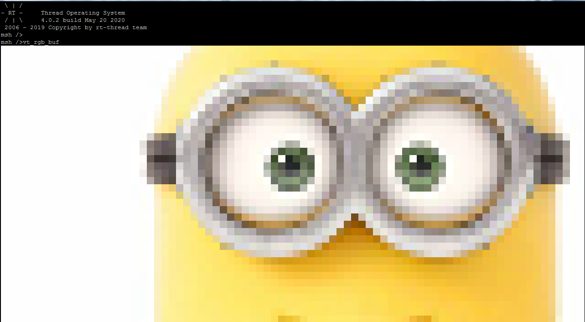
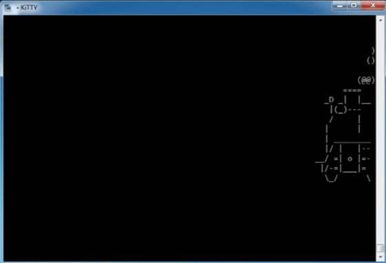
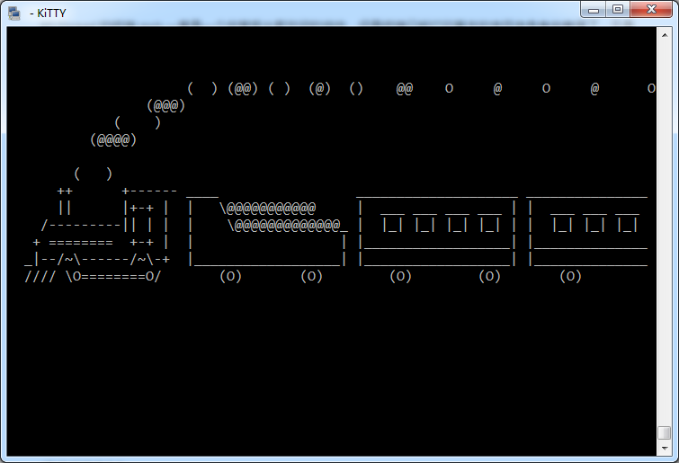
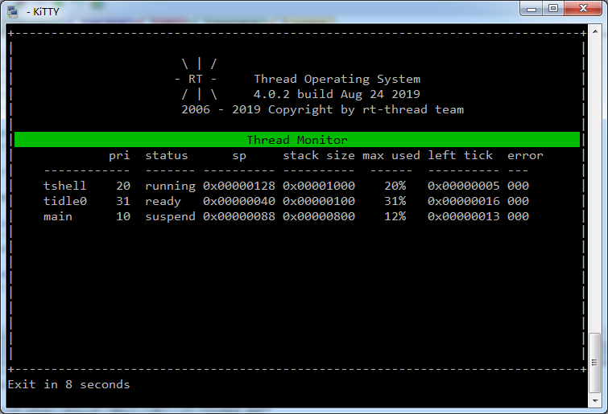
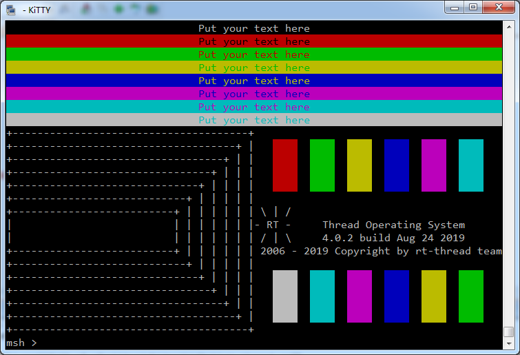

## VT-100

RT-Thread 的终端 msh 一直是一个非常受大家欢迎的组件，但是终端只能打印基本的字符未免有些单调了，于是我封装了 ANSI Escape 标准，这样就可以在 msh 里实现更加丰富的图形界面了，例如动画和游戏开发。

## 显示图片

在 examples 目录下有个直接 jpg 生成 C 代码的小工具：

```
python img2rgb888_cwh.py minions.png
```

然后就可以在控制台打印图片了

```C
#include <rtthread.h>
#include <stdio.h>

#include <vt100.h>
#include "minions.h"

void vt_rgb_buf(int argc, char* arvg[])
{
    vt_draw_rgb888(minions, minions_w, minions_h);
}
MSH_CMD_EXPORT(vt_rgb_buf, draw RGB image in console)
```



### 奔跑的小火车



小火车还有不同类型



### 实时控制台




### 绘制色条矩形




## 联系方式

- 维护：Wu Han
- 主页：http://wuhanstudio.cc
- 联系：https://github.com/wuhanstudio/vt100/issues
